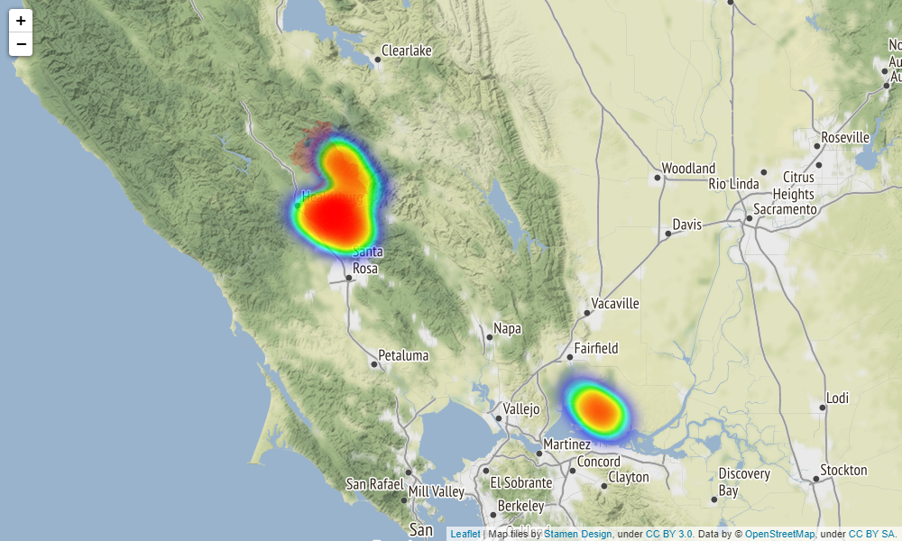

# Wildfire Detection Using Streaming Satellite Imagery

## Abstract

We propose a novel wildfire detection algorithm for multispectral satellite images. 
By observing that wildfire pixels aresparse outliers residing in a spatially correlated 
background,we isolate them using robust principal component analysis. Anovel cloud 
masking approach based on T-point thresholdingis also proposed to reduce false alarms.  
Compared to exist-ing methods, our proposed method adapts to the spatial andtemporal 
heterogeneity of satellite images,  does not requiretraining on labeled images, 
and is computationally efficientfor online monitoring.  We present an application 
of our pro-posed algorithm to the GOES-R imagery in monitoring recentCalifornia wildfires.

## Reference

Xu, S. G., Kong, S., & Asgharzadeh, Z. (2021, July). Wildfire Detection Using Streaming Satellite Imagery. 
In 2021 IEEE International Symposium on Geoscience and Remote Sensing. IEEE.

Also available at [link](https://stevengxu.github.io/projects/Wildfire_IGARSS.pdf).

## Files

1. Implementation

   This well-documented [notebook](https://nbviewer.jupyter.org/github/stevengxu/Wildfire-Detection-Using-RPCA/blob/main/notebook/Unsupervised_Wildfire_Detection_Using_GOES-16_Imagery.ipynb) provides a Python 
   pipeline for wildfire detection using the proposed method.

2. Fire Perimeter

   The **Historic_GeoMAC_Perimeters_2019** folder contains files that store the fire perimeters of major U.S. wildfires in 2019.
   In particular **US_HIST_FIRE_PERIM_2019_dd83.shp** can be used to extract the GIS shape records and **Historic_GeoMAC_Perimeters_2019**
   can be used to find the index for each fire perimeter of interest.